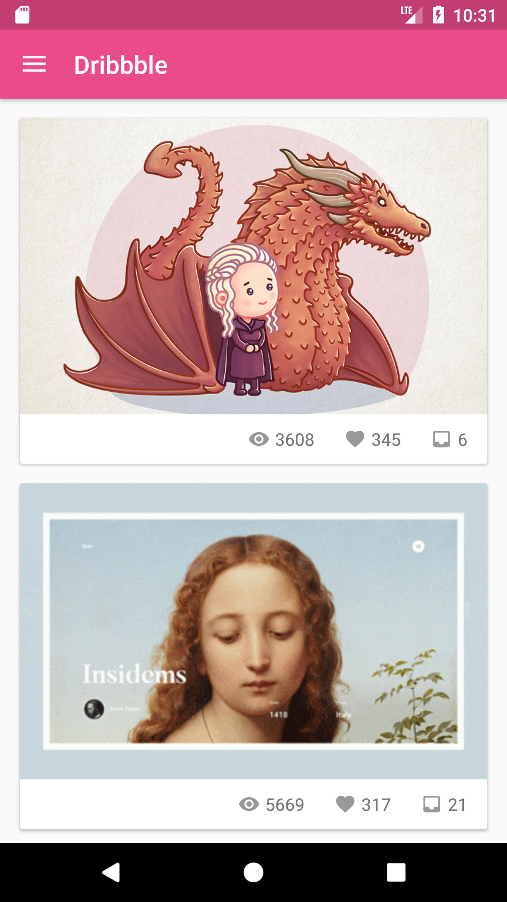
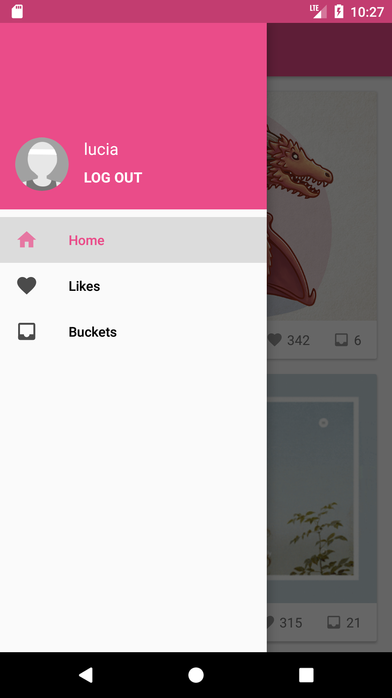
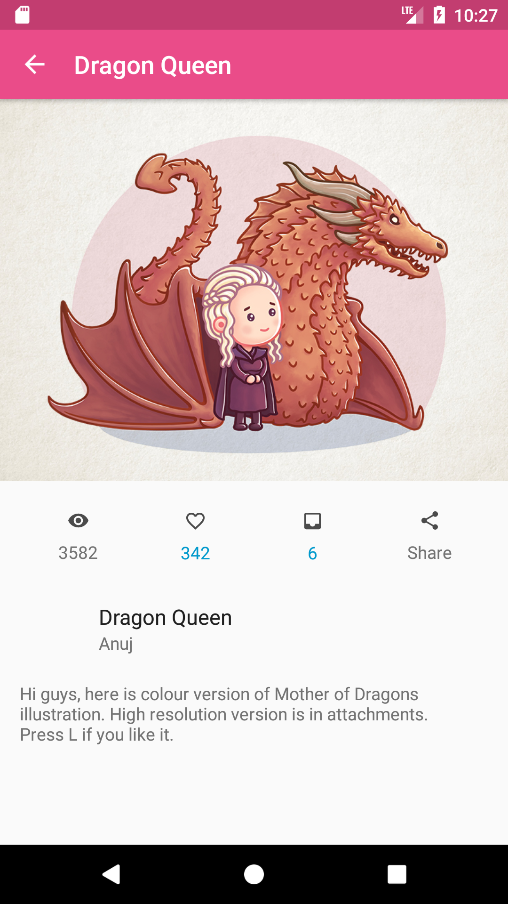
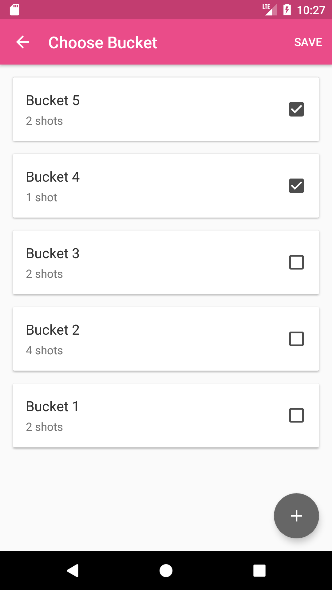

# Dribbble Android App

An Android application for [Dribbble](https://dribbble.com/).

## Highlights
+ MVC architecture
+ Material Design. Not a typical Material Design App, but you will find some familiar components.
+ Usage of several awesome libraries: [Okhttp](https://github.com/square/okhttp) for HTTP requests, [Fresco](https://github.com/facebook/fresco) for image management, [Gson](https://github.com/google/gson) for serialization & deserialization, [Butterknife](https://github.com/JakeWharton/butterknife) for binding views

## Screenshots

   
   
   
  

### Build
- clone this repo `git clone https://github.com/lucia1219cs/Dribbble-Android-App.git`
- `cd Dribbble-Android-App`
- Open in `Android Studio`
- Click `Build -> Rebuild Project`

### Notes
You may come across some build problems, try the followings:
- Update Android Studio to latest version.
- Try to clean project and restart Android Studio.
- If none of the above solve your problem, file an issue.

### Dribbble OAuth
The app client id, client secret and client access token are placed in Authenticate.java file. If you want to continue the development, I recommend you register your own App at [Dribbble Developer Center](https://dribbble.com/account/applications/new) and modify the constants with your owns.
